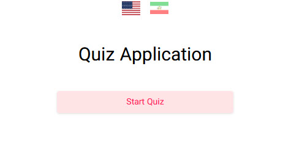
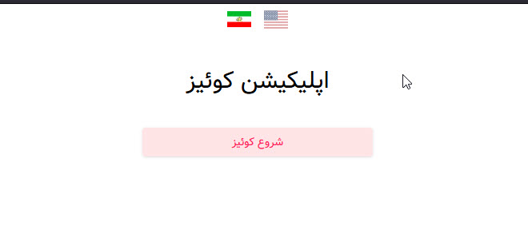
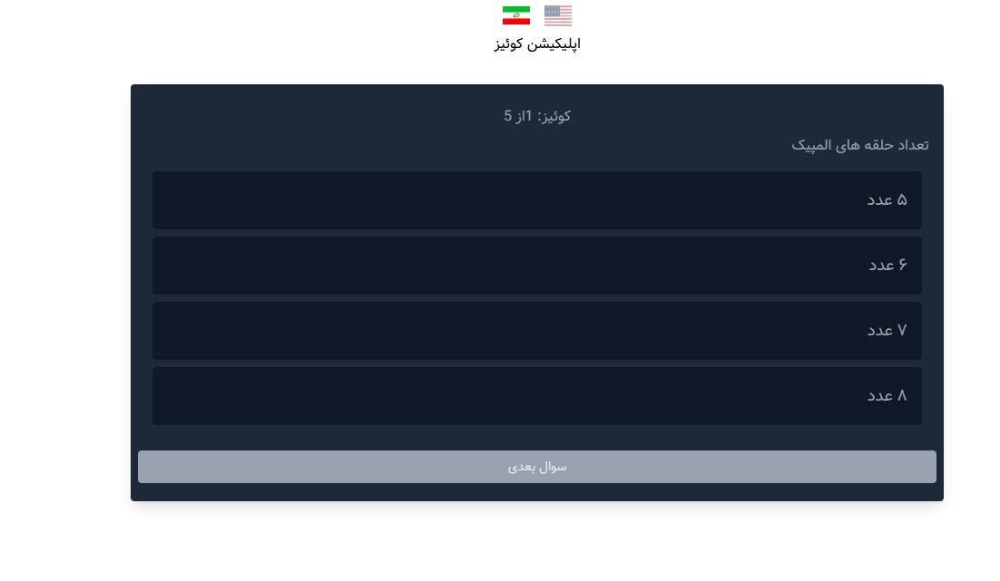
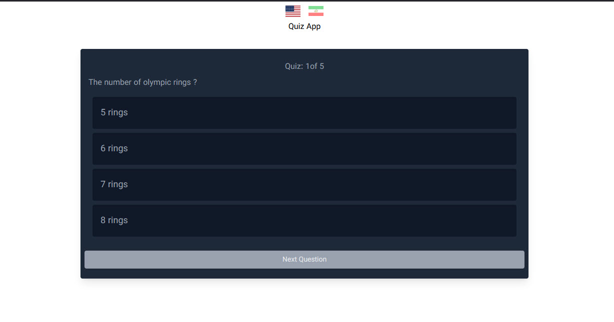

# اپلیکیشن آموزشی کوییز (Quiz App)



**اپلیکیشن کوییز** یک پلتفرم آموزشی جذاب و دو زبانه (فارسی و انگلیسی) است که با استفاده از **Next.js** ساخته شده است. این پروژه با هدف ارائه یک تجربه کاربری ساده و مدرن برای یادگیری و تمرین از طریق کوییزهای تعاملی طراحی شده است. همچنین، سیستم احراز هویت (Authentication) برای مدیریت کاربران پیاده‌سازی شده است.

## ویژگی‌ها

- **پشتیبانی از دو زبان**: رابط کاربری به دو زبان فارسی و انگلیسی برای دسترسی کاربران مختلف.
- **احراز هویت امن**: سیستم ورود و ثبت‌نام کاربران با امنیت بالا.
- **طراحی پاسخ‌گو (Responsive)**: سازگار با انواع دستگاه‌ها (موبایل، تبلت، و دسکتاپ).
- **رابط کاربری مدرن**: طراحی زیبا و کاربرپسند با استفاده از آخرین تکنولوژی‌های وب.
- **ساختار بهینه**: استفاده از **Next.js** برای عملکرد بالا و سئوی بهتر.

## پیش‌نمایش پروژه

در ادامه تصاویری از رابط کاربری پروژه را مشاهده می‌کنید:

| صفحه اصلی               | صفحه اصلی               | کویز                    | کویز                    |
| ----------------------- | ----------------------- | ----------------------- | ----------------------- |
|  |  |  |  |

## پیش‌نیازها

قبل از اجرای پروژه، اطمینان حاصل کنید که موارد زیر روی سیستم شما نصب شده باشند:

- **Node.js** (نسخه 16 یا بالاتر)
- **npm** یا **yarn**
- یک ویرایشگر کد مانند **VS Code**

## راهنمای نصب و اجرا

1. **کلون کردن پروژه**:

   ```bash
   git clone https://github.com/SayyehBan/quiz-app.git
   ```

2. **ورود به پوشه پروژه**:

   ```bash
   cd quiz-app
   ```

3. **نصب وابستگی‌ها**:

   ```bash
   npm install
   ```

   یا

   ```bash
   yarn install
   ```

4. **اجرای پروژه در حالت توسعه**:

   ```bash
   npm run dev
   ```

   یا

   ```bash
   yarn dev
   ```

5. **مشاهده پروژه**:
   مرورگر خود را باز کنید و به آدرس زیر بروید:
   ```
   http://localhost:3000
   ```

## ساختار پروژه

- **`pages/`**: شامل صفحات مختلف پروژه (مانند صفحه اصلی، کوییز، و پروفایل).
- **`components/`**: کامپوننت‌های قابل استفاده مجدد.
- **`styles/`**: فایل‌های استایل و CSS.
- **`image/`**: تصاویر مربوط به پروژه.
- **`public/`**: فایل‌های عمومی مانند تصاویر و فونت‌ها.

## تکنولوژی‌های استفاده شده

- **Next.js**: فریم‌ورک React برای توسعه وب.
- **React**: برای ساخت رابط کاربری تعاملی.
- **CSS Modules / Tailwind CSS** (در صورت استفاده): برای استایل‌دهی.
- **NextAuth.js** (در صورت استفاده): برای مدیریت احراز هویت.

## مشارکت در پروژه

اگر علاقه‌مند به همکاری در توسعه این پروژه هستید، می‌توانید از طریق ایجاد **Pull Request** یا گزارش **Issue** در گیت‌هاب مشارکت کنید. مراحل مشارکت:

1. پروژه را Fork کنید.
2. تغییرات خود را اعمال کنید.
3. یک Pull Request ایجاد کنید.

## تماس با من

برای هرگونه سوال یا پیشنهاد، می‌توانید از طریق ایمیل یا شبکه‌های اجتماعی با من در ارتباط باشید:

- **گیت‌هاب**: [SayyehBan](https://github.com/SayyehBan)

---

**با تشکر از بازدید شما!**  
امیدوارم این پروژه برای شما مفید باشد. اگر از آن لذت بردید، لطفاً یک ⭐ به پروژه بدهید!
